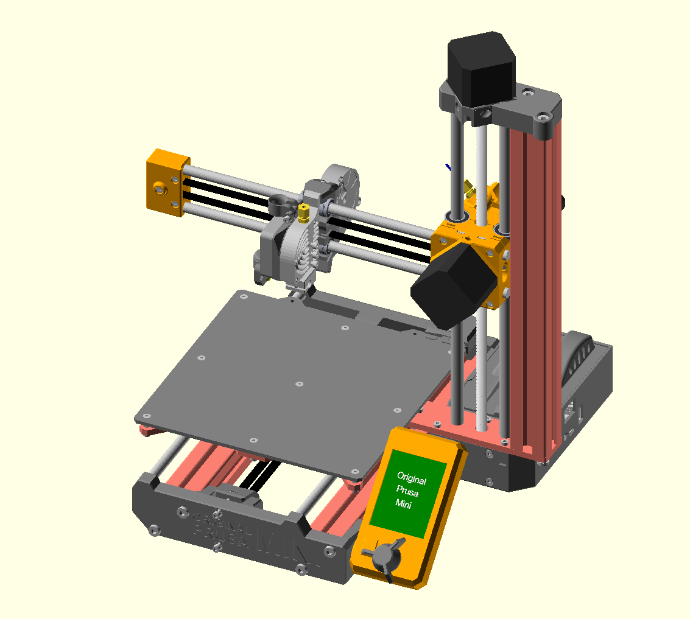

# Prusa-Mini-assembly

Note : this is WIP and not complete or checked for accuracy.

This repo is "unofficial", I have no connection with Prusa.

This repo contains OpenSCAD scripts which create an assembly for a Prusa Mini. Addtionally, a BOM is derived from the model.

Where available, 3D model files for printed parts, custom mechanical parts, PCBs are original Prusa files from the following repositories:

- https://github.com/prusa3d/Original-Prusa-MINI
- https://github.com/prusa3d/Heatbed-Mini-PCB
- https://github.com/prusa3d/Buddy-board-MINI-PCB
- https://github.com/prusa3d/MKxS-IR-sensor

Some OpenSCAD files are derived from Mendel90 project : https://github.com/nophead/Mendel90

OpenSCAD "move_stl_to_origin" derived from : https://github.com/lar3ry/OpenSCAD---Move-STL-to-origin

MCAD library is derived from : https://github.com/openscad/MCAD

New works in this repo that are not otherwise specified are Copyright CC-BY-SA Bob Cousins 2020
